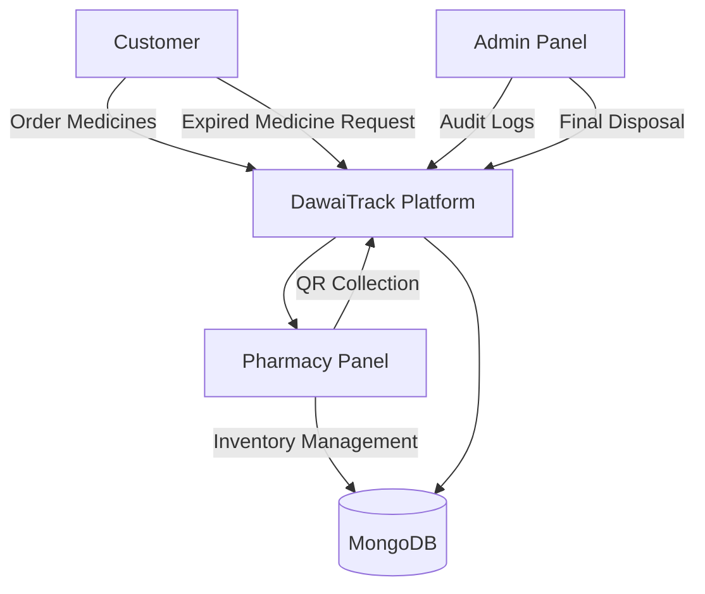
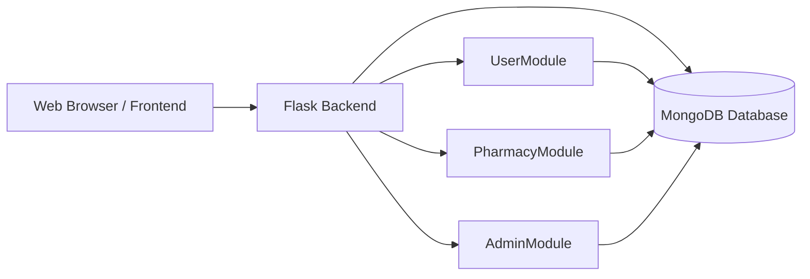
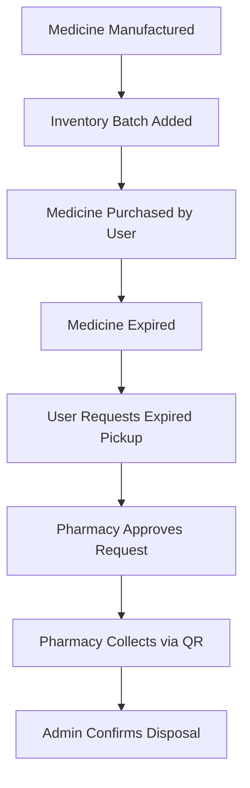
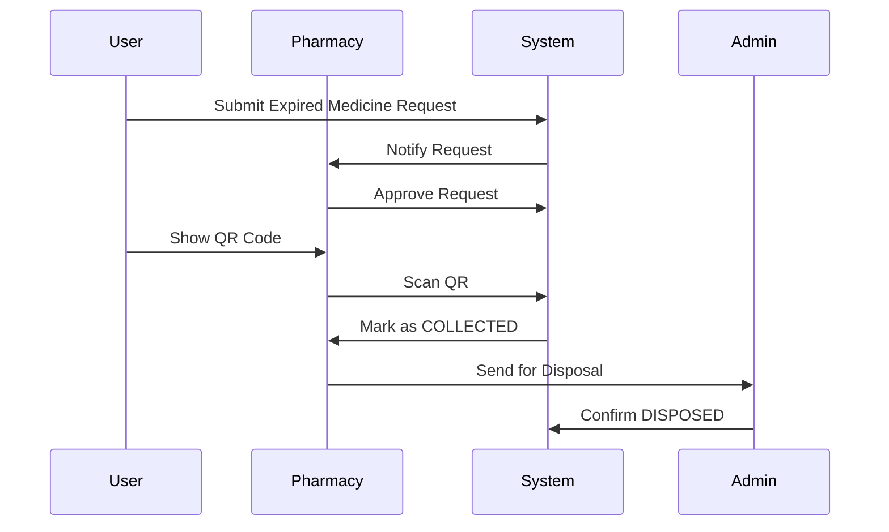
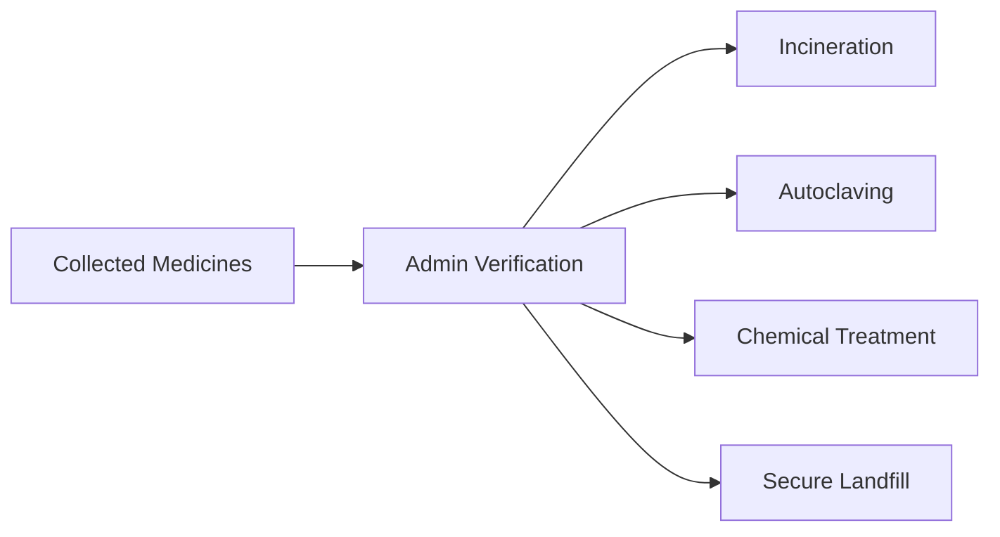
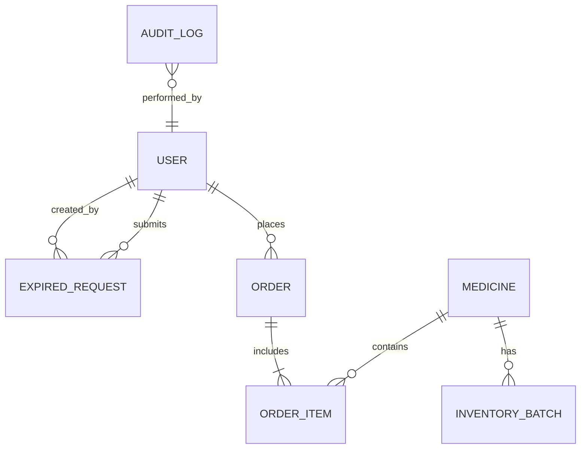

# 🟢 DawaiTrack

### Smart Medicine Platform with Expired Medicine Take-Back System


---

## 📌 Overview

DawaiTrack is a healthcare platform that combines **online pharmacy services, medicine lifecycle management, and an expired medicine take-back system**.

The platform enables users to purchase medicines, track orders, and safely return expired medicines. Pharmacies collect expired medicines using QR verification, and administrators ensure proper biomedical disposal.

This system promotes **safe medicine usage, environmental sustainability, and responsible healthcare practices**.

---

## 🎯 Project Motivation

Expired medicines stored at home can cause:

* Accidental consumption
* Environmental contamination
* Unsafe disposal practices

Most pharmacy platforms only focus on **medicine delivery**.
They lack structured mechanisms for **tracking expired medicines and disposing them safely**.

---

## 🚀 Key Features

### 👤 User Features

* User registration and login
* Medicine browsing and search
* Add to cart and checkout
* Order history
* Expired medicine return request
* QR code generation for pickup verification

---

### 🏥 Pharmacy Panel

* Medicine management
* Batch-based inventory management
* FEFO stock deduction (First Expiry First Out)
* Order management
* Expired medicine request verification
* QR code scanning for collection

---

### 🛠 Admin Panel

* Dashboard analytics
* Audit logging system
* Disposal management
* Disposal method tracking

---

## 👥 System Roles

### Customer

* Browse medicines
* Place orders
* Request expired medicine pickup
* Show QR code during pickup

### Pharmacy

* Manage medicines
* Manage inventory batches
* Verify expired requests
* Scan QR codes
* Collect expired medicines

### Admin

* Monitor system statistics
* View audit logs
* Confirm final medicine disposal

---

## ⚙️ System Architecture



---

## 🧠 High Level Architecture (HLD)



---

## 🔄 Medicine Lifecycle



---

## 🔁 Expired Medicine Collection Flow



---

## ♻️ Disposal Workflow



---

## 🧬 Database ER Diagram



---

## 📁 Project Structure

```
DawaiTrack/
├── app/
│   ├── config/
│   ├── extensions/
│   ├── models/
│   ├── routes/
│   ├── services/
│   ├── templates/
│   ├── static/
│   └── utils/
├── tests/
├── run.py
├── requirements.txt
└── README.md
```

---

## 🛠 Technology Stack

### Backend

* Python
* Flask
* MongoDB
* MongoEngine

### Frontend

* HTML
* CSS
* Bootstrap
* JavaScript

### Tools

* Chart.js
* jsQR
* QR Code API

---

## 🔐 API Endpoints

### Search
```
[GET] /api/search-suggestions?q=<query>
```
### Cart
```
[POST] /cart/add/<slug>
[GET] /cart
```
### Orders
```
[POST] /order/checkout
[GET] /order/history
```
### Expired Medicines
```
[POST] /expired/request
[GET] /expired/history
```
### Pharmacy
```
[POST] /pharmacy/expired-request/approve/<id>
[POST] /pharmacy/expired-request/collect/<id>
```
### Admin
```
[GET] /admin/dashboard
[GET] /admin/audit-logs
[POST] /admin/dispose
```
---

## 📸 Screenshots

> Replace these with actual images

* Home Page
* Cart System
* Order History
* Expired Request
* Pharmacy Panel
* Admin Dashboard

---

## ⚙️ Setup & Installation

### 1. Clone Repository

```
git clone https://github.com/anshulwycliffe/DawaiTrack.git
cd DawaiTrack
```

### 2. Install Dependencies

```
pip install -r requirements.txt
```

### 3. Configure Environment

Create `.env`:

```
SECRET_KEY=your_secret_key
MONGO_URI=mongodb://localhost:27017/dawaitrack
```

### 4. Run Application

```
python main.py
```

---

## Audit Logging System

Tracks:

* Orders
* Inventory
* Disposal

Important actions are recorded for transparency.

Example logs:

    [12 Mar 2026 14:20]  Pharmacy_01  ADD_BATCH
    Added batch B023 (Paracetamol)

    [12 Mar 2026 15:05]  User_22  ORDER_PLACED
    Order ₹350

    [12 Mar 2026 18:00]  Admin  DISPOSE_MEDICINE
    Crocin disposed via Incineration
---

## Environmental Impact

* Prevents unsafe storage
* Reduces pollution
* Ensures safe disposal

---

## Future Enhancements

* Mobile App
* AI alerts
* Barcode scanning
* Cloud scaling

---

## 📜 License

MIT License
Copyright © 2026 Anshul Wycliffe

    Permission is hereby granted, free of charge, to any person obtaining a copy of this software and associated documentation files (the “Software”), to deal in the Software without restriction, including without limitation the rights to use, copy, modify, merge, publish, distribute, sublicense, and/or sell copies of the Software, and to permit persons to whom the Software is furnished to do so, subject to the following conditions:

    The above copyright notice and this permission notice shall be included in all copies or substantial portions of the Software.

    THE SOFTWARE IS PROVIDED “AS IS”, WITHOUT WARRANTY OF ANY KIND, EXPRESS OR IMPLIED, INCLUDING BUT NOT LIMITED TO THE WARRANTIES OF MERCHANTABILITY, FITNESS FOR A PARTICULAR PURPOSE AND NONINFRINGEMENT. IN NO EVENT SHALL THE AUTHORS OR COPYRIGHT HOLDERS BE LIABLE FOR ANY CLAIM, DAMAGES OR OTHER LIABILITY, WHETHER IN AN ACTION OF CONTRACT, TORT OR OTHERWISE, ARISING FROM, OUT OF OR IN CONNECTION WITH THE SOFTWARE OR THE USE OR OTHER DEALINGS IN THE SOFTWARE.
---

## ✅ Conclusion

DawaiTrack provides a **complete medicine lifecycle ecosystem**, ensuring safe usage, verified collection, and responsible disposal.
